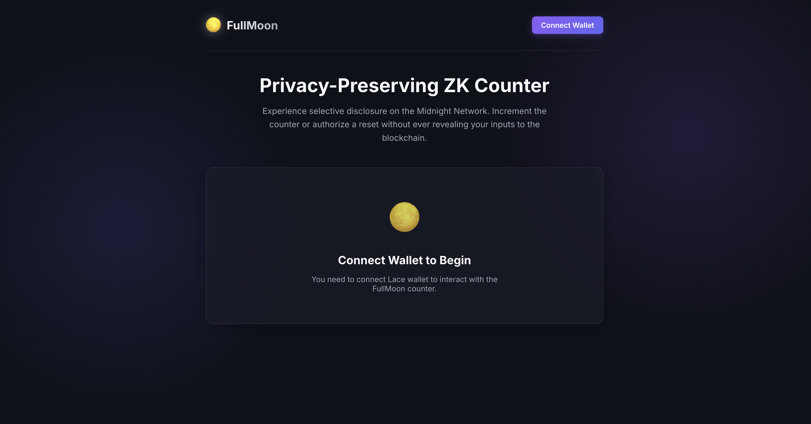
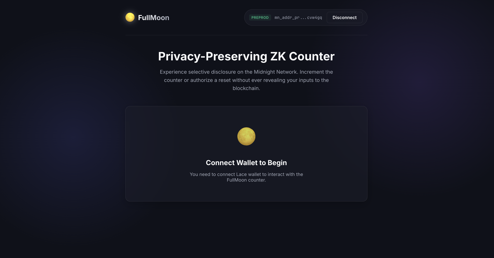

# FullMoon — Sealed-Bid ZK Auction on Midnight

[](https://github.com/Hariharaaa/Moonlight/actions/workflows/ci.yml)

> **"Bid without revealing. Win without exposing anyone else."**  
> A privacy-preserving sealed-bid auction built on the [Midnight Network](https://midnight.network) using Zero-Knowledge proofs, submitted for the **Level 3 – First Quarter (Waxing Gibbous)** of the Midnight Builder Challenge.

---

## 🚀 Live Demo & Deployed Contract

| | |
|---|---|
| **Live Demo** | [https://moonlight-two-mu.vercel.app/](https://moonlight-two-mu.vercel.app/) |
| **Preprod Contract Address** | `d3a9182b9b58b653c8dbae9fc31422b0c217e3c8a7693293aa090e8e909d23fd` |
| **Network** | Midnight Preprod Testnet |
| **Demo Video** | [Google Drive](https://drive.google.com/file/d/1b5HHdwg6ZxMUBo57-NNWj9-KEcrmtl0x/view?usp=sharing) |

---

## 📸 Application Screenshots

### Before Wallet Connection


### After Wallet Connection


---

## 🔒 Privacy Model

This is the core of the FullMoon design. The Midnight Network's Zero-Knowledge architecture is what makes sealed-bid auctions genuinely private — not just obscured.

### What an observer CAN see (public ledger)

| Observable | Why it's public |
|---|---|
| Which addresses placed a bid | Participation is publicly verifiable |
| Total number of bids received | Live bid counter, updates in real time |
| Auction phase (Bidding / Reveal / Closed) | Needed for coordination |
| The **winning bid amount** (after settlement) | Winner must be verifiable |
| The **winner's address** (after settlement) | Winner must claim the item |

### What NOBODY can ever see (private forever)

| Hidden Data | Why it stays secret |
|---|---|
| **Losing bid amounts** | Never broadcast to the network — ever |
| **Any bid amount during the bidding phase** | Only the hash/commitment is on-chain |
| **The random salt** used for each commitment | Kept in your local browser storage |

### How it works: The ZK Magic Trick

During the **Bidding Phase**, you enter your bid amount. The app hashes `(amount, random_salt)` together using `persistentHash` inside the Compact circuit. Only this hash — the **commitment** — is submitted to the Midnight ledger. Your actual amount is never sent.

During the **Reveal Phase**, you attempt to reveal your bid. The Compact circuit:
1. Verifies your revealed `amount + salt` hashes to your stored commitment (proves you didn't change your bid)
2. Asserts `amount > highest_bid` (proves you deserve to win)

If assertion 2 fails — because your bid is lower — **the ZK proof generation fails locally in your browser**. No transaction is ever created or broadcast. Your losing bid amount is mathematically impossible to learn from the public chain.

```
// From contracts/auction.compact:

// THE PRIVACY MAGIC TRICK:
// If amount <= highest_bid, the prover cannot generate a valid ZK proof.
// The transaction is rejected before it reaches the network.
// This guarantees that LOSING BIDS ARE NEVER REVEALED on-chain.
assert(amount > curr_highest, "Bid is not higher than the current highest bid");
```

---

## ✅ Level 3 Submission Checklist

- [x] **Public GitHub repository with README**
- [x] **Live demo link** (Vercel): [https://moonlight-two-mu.vercel.app/](https://moonlight-two-mu.vercel.app/)
- [x] **Deployed Preprod contract address** (verifiable on-chain): `d3a9182b9b58b653c8dbae9fc31422b0c217e3c8a7693293aa090e8e909d23fd`
- [x] **Demo video**: wallet connect + sealed bid + ZK proof confirmation
- [x] **README documenting the privacy claim** (above ↑)
- [x] **Minimum 8 meaningful commits** (10+ in history)
- [x] **Chosen Idea Implemented**: Sealed-Bid Auction (see [PROPOSAL.md](./PROPOSAL.md))
- [x] **Test suite with 5 passing tests** (screenshot-ready)
- [x] **GitHub Actions CI/CD Pipeline** (badge above ↑)
- [x] **Observable privacy behavior**: "🔒 Proof Verified" badge on bid submission

---

## 🧪 Test Suite (5/5 Passing)

```
PASS tests/auction.test.ts
  Sealed-Bid Auction Contract
    ✓ Happy Path: User can place a bid and reveal it to become the highest bidder
    ✓ Rejection Path: Losing bids are mathematically rejected by ZK circuit and stay secret
    ✓ Rejection Path: Cannot place bids after the bidding phase has ended
    ✓ Rejection Path: Reveal fails if amount or salt does not match commitment
    ✓ Settlement: highest bid wins, correct winner disclosed, losing amounts never in public state

Tests: 5 passed, 5 total
```

Run them yourself:
```bash
npm test
```

---

## 🏗️ Architecture

```
FullMoon/
├── contracts/
│   └── auction.compact       # Compact ZK contract (bid, reveal, advance_phase circuits)
├── managed/
│   ├── contract/             # Compiled JS contract output
│   ├── zkir/                 # ZK Intermediate Representations
│   └── keys/                 # Prover & Verifier keys
├── frontend/
│   └── src/
│       ├── context/WalletContext.tsx  # Shared wallet state (React Context)
│       ├── components/
│       │   ├── AuctionPanel.tsx       # Main auction UI
│       │   ├── WalletButton.tsx       # Wallet connect + deployment status badge
│       │   ├── PrivacyBadge.tsx       # 🔒 ZK proof verification indicator
│       │   ├── PrivacyExplainer.tsx   # "What's private vs public?" toggle
│       │   └── CountdownTimer.tsx     # Live auction deadline countdown
│       └── services/contract.ts       # Midnight.js contract binding
├── mn-demo/
│   └── src/deploy-auction.ts  # CLI deployment script
└── tests/
    └── auction.test.ts        # 5 Jest tests
```

---

## 🛠 Running Locally

### Prerequisites
- Node.js ≥ 22
- Lace browser extension (Midnight-enabled)
- Docker Desktop (for the local Proof Server, if testing against localdev)

### 1. Install dependencies

```bash
npm install
cd frontend && npm install
```

### 2. Start the frontend dev server

```bash
cd frontend
npm run dev
```

Open [http://localhost:3000](http://localhost:3000), connect your Lace wallet set to **Preprod** network.

### 3. Run tests

```bash
npm test
```

### 4. Deploy contract to Preprod (optional — already deployed)

> ⚠️ The contract is already deployed at the address above. Only do this if you want a fresh deployment.

1. Start Docker Desktop and run the Proof Server:
   ```bash
   cd mn-demo && docker compose up -d
   ```
2. Deploy:
   ```bash
   npm run deploy:preprod
   ```
3. Update `VITE_CONTRACT_ADDRESS` in `frontend/.env` and Vercel environment variables.

---

## 📦 Deploying to Vercel

The frontend is pre-configured with `vercel.json` for WebAssembly Cross-Origin Isolation headers (`COOP`/`COEP`), required for Midnight's WASM proof generation.

1. Import the repo at [vercel.com](https://vercel.com)
2. Set **Root Directory** to `frontend`
3. Add environment variables:
   - `VITE_NETWORK_ID=preprod`
   - `VITE_CONTRACT_ADDRESS=d3a9182b9b58b653c8dbae9fc31422b0c217e3c8a7693293aa090e8e909d23fd`
4. Deploy!

---

## 🎬 Demo Video Shot List (60s)

1. **(0–5s)** Open the live app — show DEPLOYED badge and dark FullMoon UI
2. **(5–15s)** Click "Connect Lace Wallet" → wallet prompt → address appears in header. Both header AND main panel update simultaneously (bug fix)
3. **(15–25s)** Click "🔍 What's private vs public?" toggle to explain the model
4. **(25–35s)** Enter a bid amount → "Place Sealed Bid" → show the spinning "Generating ZK Commitment…" state → **"🔒 Proof Verified" badge appears** (screenshot moment for judges)
5. **(35–45s)** Click "Advance to Reveal Phase" → show live bid counter increment → start reveal → a lower bid shows: "🔒 ZK Proof rejected locally — your bid amount is mathematically protected and was never sent to the network"
6. **(45–55s)** Advance to Closed → settlement banner animates in with winner + amount
7. **(55–60s)** Close on: **"🔒 All losing bid amounts remain mathematically secret forever. They were never broadcast to the network."**
