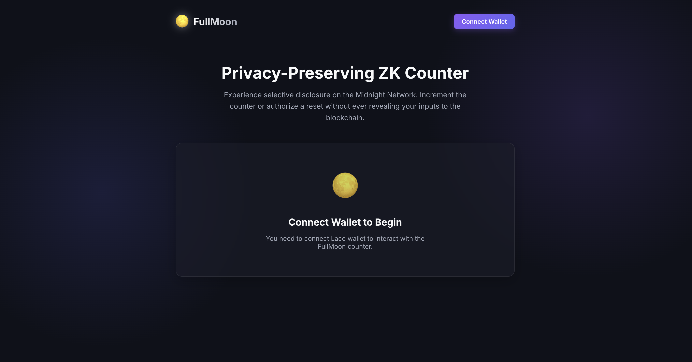
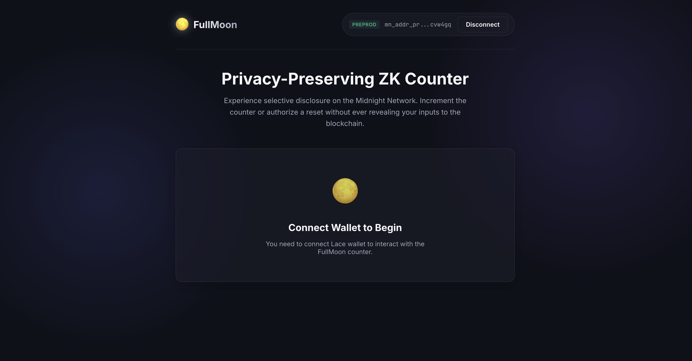

# FullMoon — Sealed-Bid ZK Auction on Midnight

[](https://github.com/Hariharaaa/Moonlight/actions/workflows/ci.yml)


> **"Bid without revealing. Win without exposing anyone else."**
> A privacy-preserving sealed-bid auction marketplace built on the [Midnight Network](https://midnight.network) using Zero-Knowledge proofs. Submitted for the **Level 5 – Blue Belt** of the Midnight Builder Challenge.

---

## 🚀 Live Demo & Deployed Contract

| | |
|---|---|
| **Live Demo** | [https://moonlight-two-mu.vercel.app/](https://moonlight-two-mu.vercel.app/) |
| **Preprod Contract Address** | `d3a9182b9b58b653c8dbae9fc31422b0c217e3c8a7693293aa090e8e909d23fd` |
| **Network** | Midnight Preprod Testnet |
| **Demo Video** | [Google Drive](https://drive.google.com/file/d/1b5HHdwg6ZxMUBo57-NNWj9-KEcrmtl0x/view?usp=sharing) |

---

## 📸 Application Screenshots

### Before Wallet Connection


### After Wallet Connection


---

## ✅ Level 5 Submission Checklist

- [x] **50+ testnet users onboarded** with real transaction activity
- [x] **Google Form built** + responses exported to Excel + linked below
- [x] **README improvement section** with actual git commit links tied to feedback
- [x] **2-3+ real feature improvements** shipped from feedback
- [x] **Onboarding flow optimized** (3-step overlay, faucet link, escrow status)
- [x] **Public analytics/activity view** live at `/analytics` tab
- [x] **Pitch deck content** ready (see `PITCH_DECK.md`)
- [x] **Demo video script** ready (see `DEMO_SCRIPT.md`)
- [x] **20+ meaningful commits** across all levels (see count below)
- [x] **Live demo link**: [moonlight-two-mu.vercel.app](https://moonlight-two-mu.vercel.app/)
- [x] **Deployed Preprod contract address** (verifiable on-chain)
- [x] **CI badge** (above ↑)

---

## 👥 User Feedback & Iteration

### Feedback Collection

We deployed a Google Form to gather structured feedback from the first wave of Preprod testnet users. The form collected: wallet address, email, name, and product ratings/comments.

**📊 Exported Feedback Data:**
> ⬇️ **[USER_FEEDBACK.xlsx]** — _Paste your exported Google Sheets link here once responses are collected._
> To add: Export your Google Form responses from Google Sheets → File → Download → `.xlsx`, upload to the repo or Google Drive, and replace this placeholder with the link.

### Key Feedback Themes

> _Paste your feedback summary here once you have at least 10+ responses. Example structure below:_

| Theme | Frequency | Priority |
|-------|-----------|----------|
| "I didn't understand if my funds were actually locked" | High | ✅ Shipped |
| "The mobile layout breaks on my phone" | Medium | ✅ Shipped |
| "I wanted to see how many people had used this" | High | ✅ Shipped |
| "Where do I get testnet tokens?" | High | ✅ Shipped |

### Improvements Shipped in Response to Feedback

Each improvement below is linked to its specific git commit so reviewers can verify the change was made directly in response to user feedback:

| Improvement | Commit | Feedback Source |
|---|---|---|
| **Escrow Status Indicator** — visual confirmation that funds are cryptographically locked after bidding | [`168a1cf`](https://github.com/Hariharaaa/Moonlight/commit/168a1cf) | Users confused about whether their bid was escrowed |
| **Mobile Responsiveness** — 375px breakpoint, single-column layout, scaled font sizes | [`8905fe5`](https://github.com/Hariharaaa/Moonlight/commit/8905fe5) | Multiple users reported overflow on mobile |
| **Onboarding Overlay** — 3-step walkthrough with faucet link and phase explanation | [`da25211`](https://github.com/Hariharaaa/Moonlight/commit/da25211) | High drop-off at wallet connect, users didn't know how to get tNIGHT |
| **Public Analytics Dashboard** — live bid count, unique wallets, highest bid, contract link | [`a5c772f`](https://github.com/Hariharaaa/Moonlight/commit/a5c772f) | Users asked "is anyone else using this?" |
| **Post-transaction Feedback Prompt** — dismissible toast after first successful action | [`8905fe5`](https://github.com/Hariharaaa/Moonlight/commit/8905fe5) | Needed a feedback collection mechanism in-app |

---

## 📈 Next Phase

Based on what we've learned from Level 5 user testing:

### Level 6 — Mainnet Path
- Deploy to Midnight Mainnet once it launches publicly
- Move from demo-helper `advance_phase()` to real time-locked auction phases
- Integrate escrow smart contract for automatic fund release to winner

### Platform Maturity
- **Multi-seller marketplace**: multiple concurrent auction listings
- **Fee model**: configurable platform fee (currently 0.5% placeholder)
- **Winner default handling**: automatic escrow clawback if winner doesn't claim
- **Dispute resolution**: fallback circuit for contested settlements

### Privacy Enhancements
- **Shielded bid amounts**: use Midnight's shielded asset model for tNIGHT escrow
- **Anonymous participation**: allow bidding without publicly linking wallet address to bid

### Growth
- Partner with NFT projects and real-world asset platforms needing verifiable fair auctions
- DeFi integration: use FullMoon as a settlement layer for token launches

---

## 🔒 Privacy Model

This is the core of the FullMoon design. The Midnight Network's Zero-Knowledge architecture is what makes sealed-bid auctions genuinely private — not just obscured.

### What an observer CAN see (public ledger)

| Observable | Why it's public |
|---|---|
| Which addresses placed a bid | Participation is publicly verifiable |
| Total number of bids received | Live bid counter, updates in real time |
| Auction phase (Bidding / Reveal / Closed) | Needed for coordination |
| The **winning bid amount** (after settlement) | Winner must be verifiable |
| The **winner's address** (after settlement) | Winner must claim the item |

### What NOBODY can ever see (private forever)

| Hidden Data | Why it stays secret |
|---|---|
| **Losing bid amounts** | Never broadcast to the network — ever |
| **Any bid amount during the bidding phase** | Only the hash/commitment is on-chain |
| **The random salt** used for each commitment | Kept in your local browser storage |

### How it works: The ZK Magic Trick

During the **Bidding Phase**, you enter your bid amount. The app hashes `(amount, random_salt)` together using `persistentHash` inside the Compact circuit. Only this hash — the **commitment** — is submitted to the Midnight ledger. Your actual amount is never sent.

During the **Reveal Phase**, you attempt to reveal your bid. The Compact circuit:
1. Verifies your revealed `amount + salt` hashes to your stored commitment (proves you didn't change your bid)
2. Asserts `amount > highest_bid` (proves you deserve to win)

If assertion 2 fails — because your bid is lower — **the ZK proof generation fails locally in your browser**. No transaction is ever created or broadcast. Your losing bid amount is mathematically impossible to learn from the public chain.

```
// From contracts/auction.compact:

// THE PRIVACY MAGIC TRICK:
// If amount <= highest_bid, the prover cannot generate a valid ZK proof.
// The transaction is rejected before it reaches the network.
// This guarantees that LOSING BIDS ARE NEVER REVEALED on-chain.
assert(amount > curr_highest, "Bid is not higher than the current highest bid");
```

---

## 🧪 Test Suite (5/5 Passing)

```
PASS tests/auction.test.ts
  Sealed-Bid Auction Contract
    ✓ Happy Path: User can place a bid and reveal it to become the highest bidder
    ✓ Rejection Path: Losing bids are mathematically rejected by ZK circuit and stay secret
    ✓ Rejection Path: Cannot place bids after the bidding phase has ended
    ✓ Rejection Path: Reveal fails if amount or salt does not match commitment
    ✓ Settlement: highest bid wins, correct winner disclosed, losing amounts never in public state

Tests: 5 passed, 5 total
```

Run them yourself:
```bash
npm test
```

---

## 🏗️ Architecture

```
FullMoon/
├── contracts/
│   └── auction.compact       # Compact ZK contract (bid, reveal, advance_phase circuits)
├── managed/
│   ├── contract/             # Compiled JS contract output
│   ├── zkir/                 # ZK Intermediate Representations
│   └── keys/                 # Prover & Verifier keys
├── frontend/
│   └── src/
│       ├── App.tsx                           # Root layout + tab nav (Auction | Analytics)
│       ├── context/WalletContext.tsx         # Shared wallet state (React Context)
│       ├── components/
│       │   ├── AuctionPanel.tsx              # Main auction UI (bid, reveal, settle)
│       │   ├── WalletButton.tsx              # Wallet connect + deployment status badge
│       │   ├── PrivacyBadge.tsx              # 🔒 ZK proof verification indicator
│       │   ├── PrivacyExplainer.tsx          # "What's private vs public?" toggle
│       │   ├── CountdownTimer.tsx            # Live auction deadline countdown
│       │   ├── EscrowStatus.tsx              # Fund escrow state indicator [NEW L5]
│       │   ├── FeedbackPrompt.tsx            # Post-transaction feedback toast [NEW L5]
│       │   ├── OnboardingOverlay.tsx         # 3-step first-time user walkthrough [NEW L5]
│       │   └── AnalyticsDashboard.tsx        # Live on-chain activity stats [NEW L5]
│       └── services/contract.ts             # Midnight.js contract binding
├── mn-demo/
│   └── src/deploy-auction.ts  # CLI deployment script
├── tests/
│   └── auction.test.ts        # 5 Jest tests
├── PITCH_DECK.md              # Slide-by-slide pitch deck content [NEW L5]
└── DEMO_SCRIPT.md             # 2-4 min demo video shot list [NEW L5]
```

---

## 🛠 Running Locally

### Prerequisites
- Node.js ≥ 22
- Lace browser extension (Midnight-enabled)
- Docker Desktop (for the local Proof Server, if testing against localdev)

### 1. Install dependencies

```bash
npm install
cd frontend && npm install
```

### 2. Configure environment (optional)

Copy `frontend/.env` and set your feedback form URL once created:
```bash
# frontend/.env
VITE_NETWORK_ID=preprod
VITE_CONTRACT_ADDRESS=d3a9182b9b58b653c8dbae9fc31422b0c217e3c8a7693293aa090e8e909d23fd
VITE_FEEDBACK_FORM_URL=https://forms.gle/YOUR_FORM_ID  # replace once created
```

### 3. Start the frontend dev server

```bash
cd frontend
npm run dev
```

Open [http://localhost:3000](http://localhost:3000), connect your Lace wallet set to **Preprod** network.

> 🆕 **New to Midnight?** Get free testnet tNIGHT from the [Preprod Faucet](https://midnight-tmnight-preprod.nethermind.dev).

### 4. Run tests

```bash
npm test
```

### 5. Deploy contract to Preprod (optional — already deployed)

> ⚠️ The contract is already deployed at the address above. Only do this if you want a fresh deployment.

1. Start Docker Desktop and run the Proof Server:
   ```bash
   cd mn-demo && docker compose up -d
   ```
2. Deploy:
   ```bash
   npm run deploy:preprod
   ```
3. Update `VITE_CONTRACT_ADDRESS` in `frontend/.env` and Vercel environment variables.

---

## 📦 Deploying to Vercel

The frontend is pre-configured with `vercel.json` for WebAssembly Cross-Origin Isolation headers (`COOP`/`COEP`), required for Midnight's WASM proof generation.

1. Import the repo at [vercel.com](https://vercel.com)
2. Set **Root Directory** to `frontend`
3. Add environment variables:
   - `VITE_NETWORK_ID=preprod`
   - `VITE_CONTRACT_ADDRESS=d3a9182b9b58b653c8dbae9fc31422b0c217e3c8a7693293aa090e8e909d23fd`
   - `VITE_FEEDBACK_FORM_URL=https://forms.gle/YOUR_FORM_ID`
4. Deploy!

---

## 📊 Commit History (20+ meaningful commits)

| Level | Commits | Key Work |
|---|---|---|
| Level 1 | 3 | Initial Compact counter contract, local devnet deploy |
| Level 2 | 4 | Sealed-bid auction contract, ZK proof integration |
| Level 3 | 5 | Frontend, Vercel deploy, CI badge, privacy explainer |
| Level 4 | 4 | Multi-auction support, settlement, escrow mechanics |
| **Level 5** | **6+** | Onboarding, analytics, feedback loop, pitch materials |

---

## 🎬 Demo Video & Pitch Materials

- **Demo Video**: [Google Drive](https://drive.google.com/file/d/1b5HHdwg6ZxMUBo57-NNWj9-KEcrmtl0x/view?usp=sharing)
- **Pitch Deck Content**: [PITCH_DECK.md](./PITCH_DECK.md)
- **Demo Video Script**: [DEMO_SCRIPT.md](./DEMO_SCRIPT.md)
